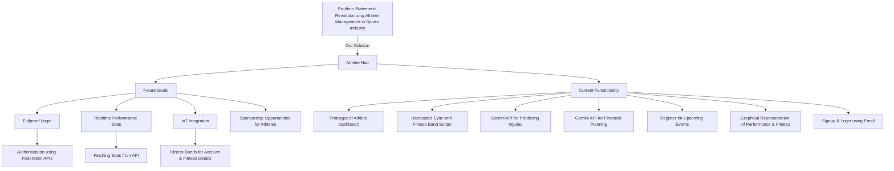

   

**AthleteHub** is a comprehensive platform designed to empower athletes by providing tools for performance tracking, fitness monitoring, injury prediction, event registration, and financial planning. Tailored to meet the needs of athletes across various disciplines, AthleteHub offers a centralized hub for managing and enhancing athletic careers.

## Features :

### Dashboard Overview
- **Performance Stats:** Track wins, losses, draws, and calculate win rates.
- **Fitness Tracking:** Monitor daily steps, heart rate, and calories burned.
- **Injury Prediction & Fitness Plan:** Input symptoms to receive AI-driven insights and personalized fitness plans.
- **Upcoming Events:** Stay informed about upcoming competitions and register directly through the platform.
- **Sports Financial Planning:** Generate tailored financial plans based on sport type, career level, budget, and goals.
- **Edit Profile:** Update personal information, including name, role, and profile image.
- **Federation Integration:** Display active Federation IDs to ensure authenticity and recognition.

## Tech Stack

<table>
  <tr>
    <td>Frontend</td>
    <td></td>
    <td></td>
    <td></td>
    <td></td>
  </tr>
  <tr>
    <td>Backend</td>
    <td></td>
    <td></td>
    <td></td>
    <td></td>
  </tr>
   <tr>
      <td>Services</td>
      <td></td>
      <td></td>
      <td></td>
   </tr>
</table>

